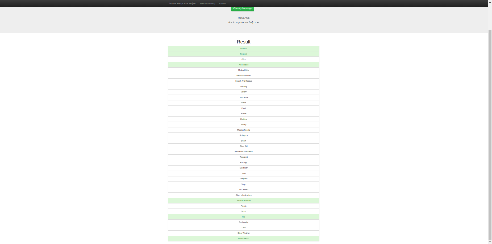
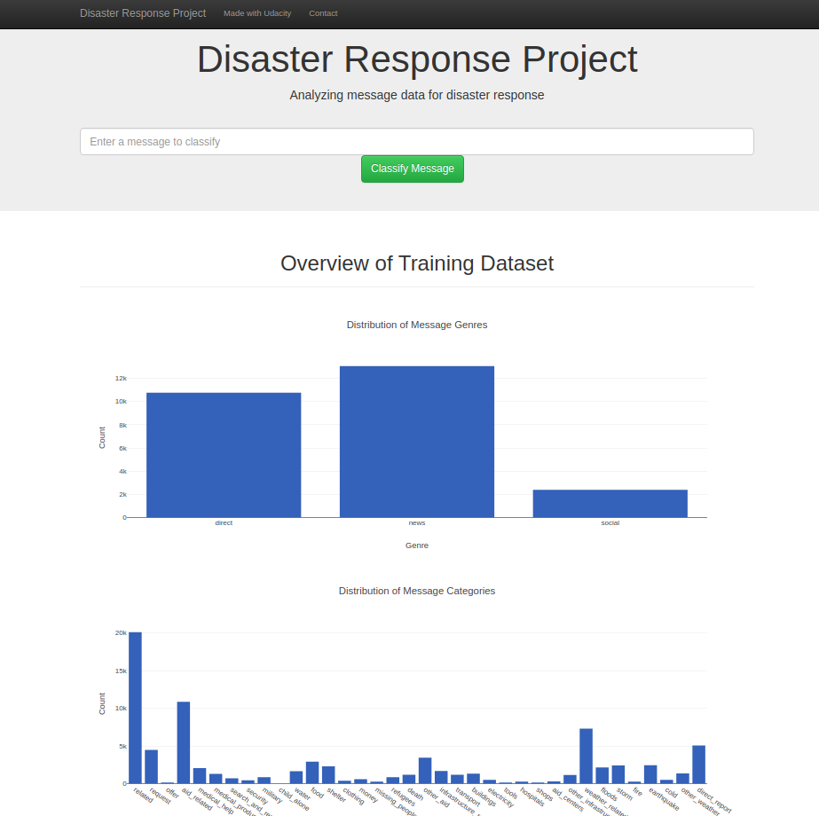

# Disaster Response Pipeline Project


## Deployed At :-
https://disaster-responses-classifiers.herokuapp.com/

## Table of Contents
1. [Description](#description)
2. [Getting Started](#getting_started)
	1. [Dependencies](#dependencies)
	2. [Installing](#installing)
	3. [Executing Program](#executing)
3. [Authors](#authors)
4. [License](#license)
5. [Acknowledgement](#acknowledgement)
6. [Screenshots](#screenshots)

<a name="descripton"></a>
## Description

This Project is representative of Udacity's Data Science Nanodegree Program in partnership with Figure Eight.
The original dataset includes pre-labeled tweet, and real-life disaster posts.
The project's aim is to create a Natural Language Processing Tool that categorizes messages.

The Project is divided in the following Sections:

1. Data Processing, ETL Pipeline to extract data from source, clean data and save them in a proper databse structure
2. Machine Learning Pipeline to train a model able to classify text message in categories
3. Web App to show model results in real time. 

<a name="getting_started"></a>
## Getting Started

<a name="dependencies"></a>
### Dependencies
* Python 3.5+ (I used Python 3.7)
* Machine Learning Libraries: NumPy, SciPy, Pandas, Sciki-Learn
* Natural Language Process Libraries: NLTK
* SQLlite Database Libraqries: SQLalchemy
* Web App and Data Visualization: Flask, Plotly

<a name="installing"></a>
### Installing
Clone this GIT repository:
```
git clone https://github.com/sachindevangan/Disaster-Response-Pipeline
```
<a name="executing"></a>
### Executing Program:
1. Run the following commands in the project's root directory to set up your database and model.

    - To run ETL pipeline that cleans data and stores in database
        `python data/process_data.py data/disaster_messages.csv data/disaster_categories.csv data/DisasterResponse.db`
    - To run ML pipeline that trains classifier and saves
        `python models/train_classifier.py data/DisasterResponse.db models/classifier.pkl`

2. Run the following command in the app's directory to run your web app.
    `python run.py`

3. Go to http://0.0.0.0:3001/


<a name="authors"></a>
## Authors

* [Sachin Devangan](https://github.com/sachindevangan)

<a name="license"></a>
## License
[](https://opensource.org/licenses/MIT)

<a name="acknowledgement"></a>
## Acknowledgements

* [Udacity](https://www.udacity.com/) for providing such a complete Data Science Nanodegree Program
* [Figure Eight](https://www.figure-eight.com/) for providing messages dataset to train my model

<a name="screenshots"></a>
## Screenshots

1. This is an example of a message you can type to test Machine Learning model performance


2. After clicking **Classify Message**, you can see the categories which the message belongs to highlighted in green



3. The main page shows some graphs about training dataset, provided by Figure Eight


